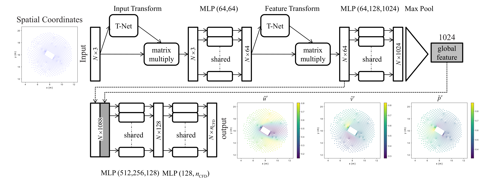

# PointNet for CFD (Computational Fluid Dynamics)

**Point-Cloud Deep Learning for Prediction of Fluid Flow Fields on Irregular Geometries (Supervised Learning)**

**Authors:** Ali Kashefi (kashefi@stanford.edu) and Davis Rempe (drempe@stanford.edu) 
**Description:** Implementation of PointNet for *supervised learning* of computational mechanics on domains with irregular geometries  
**Version:** 1.0  
**Guidance:** We recommend opening and running the code on **[Google Colab](https://research.google.com/colaboratory)** as a first try.

**Citation**  
If you use the code, please cite the following journal paper:  
**[A point-cloud deep learning framework for prediction of fluid flow fields on irregular geometries](https://aip.scitation.org/doi/full/10.1063/5.0033376)**

    @article{kashefi2021PointNetCFD, 
      author = {Kashefi, Ali  and Rempe, Davis  and Guibas, Leonidas J.}, 
      title = {A point-cloud deep learning framework for prediction of fluid flow fields on irregular geometries},
      journal = {Physics of Fluids},
      volume = {33}, 
      number = {2}, 
      pages = {027104},
      year = {2021},
      doi = {10.1063/5.0033376},}

**1. Introduction**  
We provide the implementation of [PointNet](https://arxiv.org/abs/1612.00593) for the prediction of quantities of interest in the area of computational mechanics on domains with irregular geometries. Specifically, we present the example of flow past a cylinder with various shapes for its cross sections. We hope that this simple example motivates other researchers to use [PointNet](https://arxiv.org/abs/1612.00593) for different areas of computational mechanics and physics such as compressible flows, solid mechanics, etc.  
To make the code usable for everyone (even with a moderate knowledge of deep learning), we implement the code using [Keras](https://keras.io/). We explain the procedure step by step. 
We strongly recommend users read the journal paper **"A point-cloud deep learning framework for prediction of fluid flow fields on irregular geometries"** (https://aip.scitation.org/doi/full/10.1063/5.0033376).  
You might also find free versions of this article on [arXiv](http://arxiv-export-lb.library.cornell.edu/abs/2010.09469) or [ResearchGates](https://www.researchgate.net/publication/349544773_A_point-cloud_deep_learning_framework_for_prediction_of_fluid_flow_fields_on_irregular_geometries/stats). 

**2. Google Colab**  
We strongly recommend running the code on Google Colab as a first try. Here is a link to Colab https://research.google.com/colaboratory. In this way, you will not need to install different libraries. Moreover, you do not need to be worried about matching the required libraries.

**3. Flow past a cylinder**  
We consider laminar steady-state flow past a cylinder with different shapes for its cross sections. In fact, we consider the same example discussed in the journal paper. Please see *Figure 2* and *Figure 3* of the [journal paper](https://aip.scitation.org/doi/full/10.1063/5.0033376) for the generated meshes and flow fields. For geometries of the cross-section of the cylinder, we use those geometries described in *Table 1* of the [journal paper](https://aip.scitation.org/doi/full/10.1063/5.0033376). However, due to reducing the data size and making it possible to run the code in a reasonable amount of time on Google Colab, we only consider "circle," "equilateral hexagon," "equilateral pentagon," "square," and "equilateral triangle." For the fluid and flow properties such as density, viscosity, and the magnitude of free stream velocity, please see the section of *Governing equations of fluid dynamics* of the [journal paper](https://aip.scitation.org/doi/full/10.1063/5.0033376) for further details.

**Please read the rest of this documentation by opening the "PointNetCFD.ipynb" file on Google Colab.**

**Questions?**  
If you have any questions or need assistance, please do not hesitate to contact Ali Kashefi (kashefi@stanford.edu) or Davis Rempe (drempe@stanford.edu) via email. 

**About the Author**  
Please see the author's website: [Ali Kashefi](https://web.stanford.edu/~kashefi/) 
