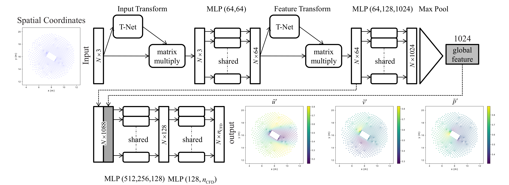

# PointNet for Computational Fluid Dynamics (CFD)



**Point-Cloud Deep Learning for Prediction of Fluid Flow Fields on Irregular Geometries (Supervised Learning)**

**Authors:** Ali Kashefi (kashefi@stanford.edu) and Davis Rempe (drempe@stanford.edu)<br>
**Description:** Implementation of PointNet for *supervised learning* of computational mechanics on domains with irregular geometries <br>

**Citation** <br>
If you use the code, please cite the following journal paper: <br>
**[A point-cloud deep learning framework for prediction of fluid flow fields on irregular geometries](https://doi.org/10.1063/5.0033376)**

    @article{kashefi2021PointNetCFD, 
      author = {Kashefi, Ali  and Rempe, Davis  and Guibas, Leonidas J.}, 
      title = {A point-cloud deep learning framework for prediction of fluid flow fields on irregular geometries},
      journal = {Physics of Fluids},
      volume = {33}, 
      number = {2}, 
      pages = {027104},
      year = {2021},
      doi = {10.1063/5.0033376}}

**Abstract** <br>
We present a novel deep learning framework for flow field predictions in irregular domains when the solution is a function of the geometry of either the domain or objects inside the domain. Grid vertices in a computational fluid dynamics (CFD) domain are viewed as point clouds and used as inputs to a neural network based on the PointNet architecture, which learns an end-to-end mapping between spatial positions and CFD quantities. Using our approach, (i) the network inherits desirable features of unstructured meshes (e.g., fine and coarse point spacing near the object surface and in the far field, respectively), which minimizes network training cost; (ii) object geometry is accurately represented through vertices located on object boundaries, which maintains boundary smoothness and allows the network to detect small changes between geometries and (iii) no data interpolation is utilized for creating training data; thus accuracy of the CFD data is preserved. None of these features are achievable by extant methods based on projecting scattered CFD data into Cartesian grids and then using regular convolutional neural networks. Incompressible laminar steady flow past a cylinder with various shapes for its cross section is considered. The mass and momentum of predicted fields are conserved. We test the generalizability of our network by predicting the flow around multiple objects as well as an airfoil, even though only single objects and no airfoils are observed during training. The network predicts the flow fields hundreds of times faster than our conventional CFD solver, while maintaining excellent to reasonable accuracy.

**Installation** <be>
This guide will help you set up the environment required to run the code. Follow the steps below to install the necessary dependencies.

**Step 1: Download and Install Miniconda**

1. Visit the [Miniconda installation page](https://docs.conda.io/en/latest/miniconda.html) and download the installer that matches your operating system.
2. Follow the instructions to install Miniconda.

**Step 2: Create a Conda Environment**

After installing Miniconda, create a new environment:

```bash
conda create --name myenv python=3.8
```

Activate the environment:

```bash
conda activate myenv
```

**Step 3: Install PyTorch**

Install PyTorch with CUDA 11.8 support:

```bash
pip3 install torch torchvision torchaudio --index-url https://download.pytorch.org/whl/cu118
```

**Step 4: Install Additional Dependencies**

Install the required Python libraries:

```bash
pip3 install numpy matplotlib trimesh torchsummary
```

**PointNet for CFD using KAN (Kolmogorov-Arnold Networks)** <be>

Implementation of PointNet using KANs instead of MLPs can be found here:

[KAN PointNet for CFD](https://github.com/Ali-Stanford/KAN_PointNet_CFD/blob/main/others/PointNetKAN_alternative.py)

**Questions?** <br>
If you have any questions or need assistance, please do not hesitate to contact Ali Kashefi (kashefi@stanford.edu) via email. 

**About the Author** <br>
Please see the author's website: [Ali Kashefi](https://web.stanford.edu/~kashefi/) 
